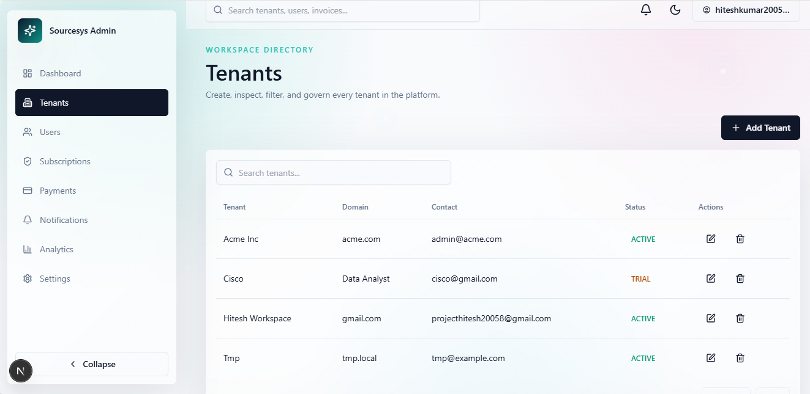
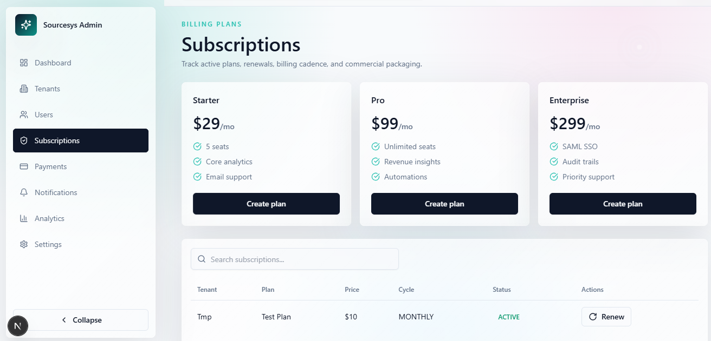
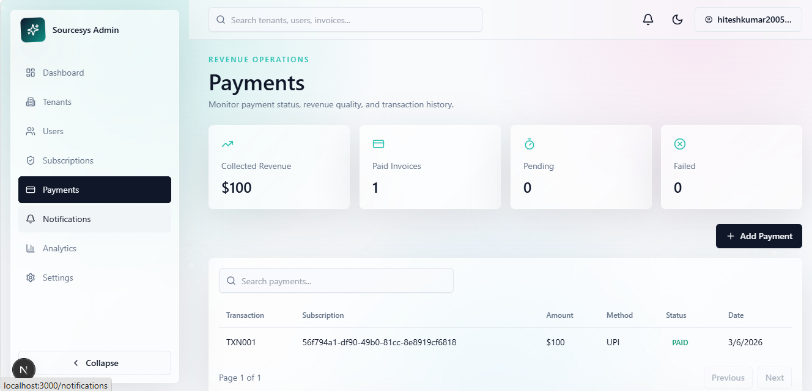

# 🚀 SaaS Dashboard Frontend

<div align="center">


### 🌟 Enterprise SaaS Frontend Platform

Modern SaaS Dashboard built using Next.js 15, Tailwind CSS, Firebase Authentication, Framer Motion, React Query, and Premium UI/UX Design.

</div>

---

# ✨ Features

## 🔐 Authentication

### User Authentication

✅ Login

✅ Signup

✅ Google Login

✅ Firebase Authentication

✅ JWT Authentication

✅ Session Persistence

✅ Protected Routes

---

## 👤 User Portal

### Dashboard

* Overview Cards
* Subscription Summary
* Payment Summary
* Notifications
* Profile Information

### Profile

* Update Profile
* Avatar Support
* Account Management

### Subscription

* Browse Plans
* Active Plans
* Renew Plans
* Upgrade Plans

### Payments

* Payment History
* Transaction Tracking
* Dummy Payment Flow

### Notifications

* Real-Time Notifications
* Read / Unread Tracking
* Notification Center

### Settings

* User Preferences
* Theme Settings
* Security Settings

---

## 🖥️ Admin Dashboard

### Dashboard

* Total Users
* Total Tenants
* Revenue Overview
* Active Subscriptions
* Analytics

### User Management

* Create User
* Edit User
* Delete User
* Search & Filter

### Tenant Management

* Create Tenant
* Update Tenant
* Delete Tenant
* Tenant Analytics

### Subscription Management

* Create Subscription
* Track Renewals
* Manage Plans

### Payment Management

* Revenue Tracking
* Transaction History
* Payment Analytics

### Notifications

* Create Notifications
* Broadcast Notifications
* User Notification Tracking

### Settings

* Branding
* SMTP
* Security
* General Settings

---

# 📸 Application Screenshots

<div align="center">

<h3>🔐 User Login</h3>


<br><br>

<h3>👤 User Dashboard</h3>


<br><br>

<h3>📊 Admin Dashboard</h3>


<br><br>

<h3>🏢 Tenant Management</h3>


<br><br>

<h3>📦 Subscription Management</h3>


<br><br>

<h3>💳 Payment Management</h3>


</div>

---

# 🎨 UI / UX Features

Inspired by:

* Linear
* Stripe
* Framer
* Vercel
* Supabase
* Notion

### Design Features

✨ Glassmorphism

✨ Animated Gradients

✨ Dark Mode

✨ Light Mode

✨ Floating Cards

✨ Framer Motion Animations

✨ Responsive Design

✨ Hover Effects

✨ Micro Interactions

✨ Modern SaaS UI

---

# 🏗️ Project Structure

```text
frontend/
│
├── public/
│
├── src/
│   │
│   ├── app/
│   │   │
│   │   ├── dashboard/
│   │   ├── tenants/
│   │   ├── users/
│   │   ├── subscriptions/
│   │   ├── payments/
│   │   ├── notifications/
│   │   ├── analytics/
│   │   ├── settings/
│   │   │
│   │   └── user/
│   │       │
│   │       ├── login/
│   │       ├── signup/
│   │       ├── dashboard/
│   │       ├── profile/
│   │       ├── subscription/
│   │       ├── payments/
│   │       ├── notifications/
│   │       └── settings/
│   │
│   ├── components/
│   │
│   ├── contexts/
│   │   ├── AuthContext.js
│   │   ├── ThemeContext.js
│   │   └── UserAuthContext.js
│   │
│   ├── hooks/
│   │
│   ├── services/
│   │
│   ├── lib/
│   │   ├── api.js
│   │   └── firebase.js
│   │
│   ├── features/
│   │   │
│   │   ├── dashboard/
│   │   ├── tenants/
│   │   ├── users/
│   │   ├── subscriptions/
│   │   ├── payments/
│   │   ├── notifications/
│   │   ├── analytics/
│   │   ├── settings/
│   │   └── user/
│   │
│   ├── styles/
│   ├── utils/
│   └── constants/
│
├── .env.local
├── package.json
├── next.config.js
├── jsconfig.json
└── README.md
```

---

# 🔥 Environment Variables

Create:

```env
frontend/.env.local
```

Add:

```env
NEXT_PUBLIC_API_URL=https://your-backend.onrender.com/api

NEXT_PUBLIC_FIREBASE_API_KEY=

NEXT_PUBLIC_FIREBASE_AUTH_DOMAIN=

NEXT_PUBLIC_FIREBASE_PROJECT_ID=

NEXT_PUBLIC_FIREBASE_STORAGE_BUCKET=

NEXT_PUBLIC_FIREBASE_MESSAGING_SENDER_ID=

NEXT_PUBLIC_FIREBASE_APP_ID=
```

---

# 🔌 Backend Integration

Backend URL:

```text
https://your-backend.onrender.com/api
```

Axios Configuration:

```javascript
src/lib/api.js
```

Features:

* JWT Token Injection
* Refresh Token Handling
* Auto Logout
* Error Handling
* API Interceptors

---

# 🔐 Firebase Authentication

Supported:

✅ Google Login

✅ Firebase Popup Authentication

✅ Session Persistence

✅ Automatic User Registration

### Firebase Setup

1. Create Firebase Project
2. Enable Authentication
3. Enable Google Provider
4. Copy Firebase Config
5. Add Environment Variables

---

# 🚀 Installation

Clone Repository

```bash
git clone <repository-url>
```

Move to Frontend

```bash
cd frontend
```

Install Dependencies

```bash
npm install
```

Run Development Server

```bash
npm run dev
```

Frontend:

```text
http://localhost:3000
```

---

# 🌐 Deployment

## Vercel

Import Project

```text
GitHub Repository
```

Root Directory:

```text
frontend
```

Build Command:

```bash
npm run build
```

Install Command:

```bash
npm install
```

Add Environment Variables.

Deploy.

---

# 📦 Major Libraries

### Core

* Next.js 15
* React 19
* JavaScript

### UI

* Tailwind CSS
* ShadCN UI
* Lucide Icons

### Animations

* Framer Motion

### Data Fetching

* React Query
* Axios

### Charts

* Recharts

### Tables

* TanStack Table

### Authentication

* Firebase
* JWT

---

# 📱 Responsive Design

Supported Devices:

✅ Mobile

✅ Tablet

✅ Laptop

✅ Desktop

---

# 🔒 Security Features

* JWT Authentication
* Refresh Tokens
* Protected Routes
* Firebase Authentication
* Environment Variables
* Secure API Requests

---

# 👨‍💻 Author

## Hitesh Kumar S

🎓 Amrita Vishwa Vidyapeetham

💻 Full Stack Developer

🚀 Next.js | Django | PostgreSQL | Firebase

---

<div align="center">

### ⭐ Star this repository if you found it useful

Built with ❤️ using Next.js, Firebase, Tailwind CSS, and Django REST Framework.

</div>
